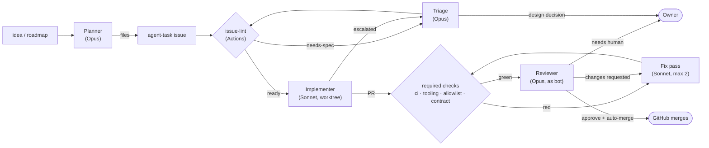

# Claude coding pipeline

A template for running software work through Claude Code agents with as little
human involvement as possible: a **planner** files issues, **implementers** on
an efficient model work them in isolated worktrees, a **reviewer** on a strong
model judges every change and approves it under its own GitHub account, and
**GitHub** merges the moment the approval and every required check are green.

The owner is needed only for decisions no agent should make: design questions,
art and other human deliverables, and milestone calls.

It was extracted from a real project (a Godot game, one developer plus Claude,
~250 agent-authored PRs) after the first version of the same idea kept landing
on its owner's desk. `docs/LESSONS.md` records what went wrong and which rule
fixed it.

---

## How it works



**Three ideas carry the design:**

1. **Every state has a next owner.** GitHub labels are the state machine
   (`status:ready`, `status:in-progress`, `status:in-review`,
   `status:escalated`, `status:needs-human`, …). A deterministic script decides
   what each state needs; agents only make judgement calls. Nothing is inferred
   from branch names or local worktrees.
2. **The platform enforces the rules, not the agents' good behaviour.** Branch
   protection requires the checks and one approval from someone other than the
   author. Every agent pushes as the owner, so only the reviewer bot's approval
   counts. Nobody — agent or owner — can merge unreviewed or red code, or push to
   the default branch.
3. **Work is cut into single seams with a declared blast radius.** Each issue
   pins its interface and lists the files it may touch. A hook refuses
   out-of-scope edits as they happen; CI refuses them in the diff. That is what
   makes parallel agents safe and reviews checkable.

### Roles

| Role | Where | Model | Job |
|---|---|---|---|
| Tick | `/pipeline-tick` on a schedule | Sonnet, low effort | Survey GitHub, claim work, spawn agents, report |
| Planner | `.claude/agents/github-planner.md` | Opus | `idea` issues and the roadmap → agent-task issues, interface first |
| Implementer | `.claude/agents/github-issue-resolver.md` | Sonnet | One issue → one PR; or one fix pass on a PR |
| Reviewer | `.claude/agents/github-pr-reviewer.md` + skill | Opus | Review against the contract, fix mechanical defects, approve as the bot |
| Triage | `.claude/agents/github-triage.md` | Opus | Answer escalations and repair rejected specs, once |
| Decision logic | `.claude/pipeline/pipeline.py` | — | What is ready, what needs review / a fix / nothing; tested offline |
| CI | `.github/workflows/` | — | Tests, allowlist, PR shape, issue readiness |

### What reaches the owner

The tick's *Needs you* list, nothing else: design contradictions, second
escalations after triage, PRs that used all their fix or conflict passes,
reviews that never reach a verdict, CI that never finishes, `human-decision` and
`asset` issues, anything touching the pipeline's own files, PRs from forks or
bound to no issue, a red default branch, and roadmap steps marked as human
gates. The kill switch is one label: `pipeline:pause` on any open issue.

---

## Quickstart

1. **Get the files** — *Use this template* for a new repo, or copy them into an
   existing one (`docs/ADOPTING.md` § B).
2. **Fit it to the project** — `.claude/pipeline/config.json`, `run_tests.sh`,
   the `ci` job, *Project rules* in `CONTRIBUTING-agents.md`, `CLAUDE.md`,
   `docs/ROADMAP.md` (`docs/ADOPTING.md` § C).
3. **Set up once** — tools, a restricted token for the agents, a reviewer bot
   account and token, then `.claude/bin/pipeline setup-repo`
   (`docs/Pipeline.md` § *Setup*).
4. **Run a tick** — `/pipeline-tick` by hand in `dontAsk` mode, then schedule
   it (a fresh `claude -p` session per tick, or a desktop app scheduled task).
5. **Feed it** — open an issue labelled `idea` with one line of what you want.

## Requirements

- Claude Code (the tick and the agents run locally; they spawn subagents in git
  worktrees).
- GitHub with **branch protection** available: a public repository, or GitHub
  Pro/Team for a private one.
- A second GitHub account for the reviewer bot.
- A fine-grained token for the agents: this repository only, no Administration
  and no Workflows permission. The platform rules hold because the agents
  cannot change them (`docs/Pipeline.md` § *What binds an agent*).
- On the machine running the tick: `gh` (authenticated with that token), `jq`,
  Python ≥ 3.9, bash (Git Bash on Windows), and the project's toolchain.

---

## Repository layout

```
.claude/
  agents/        planner, implementer (resolver), reviewer, triage
  commands/      pipeline-tick.md — the dispatcher
  skills/        github-pr-review, github-issue-create, interactive helpers
  hooks/         allowlist_guard.sh, bash_guard.sh, lib/issue_scope.sh (the one
                 parser), lib/pr_allowlist.sh (the allowlist check) + tests
  bin/           pipeline (Python shim), gh-reviewer (gh as the bot)
  pipeline/      pipeline.py, config.json, tests/
  settings.json  hook registration, permissions for unattended runs
.github/
  workflows/     ci.yml (ci, tooling), pr-contract.yml (allowlist, contract), issue-lint.yml
  ISSUE_TEMPLATE/ agent-task.md, asset-task.md
  pull_request_template.md
CLAUDE.md                 project guidelines template
CONTRIBUTING-agents.md    the contract: seams, allowlist, DoD, escalation, review routing
docs/
  Pipeline.md             the flow: roles, states, merging, tick, setup
  ADOPTING.md             how to bring it into a project, and what to customise
  AgentEnvironment.md     machine facts template
  ROADMAP.md              roadmap template the planner reads
  LESSONS.md              why each rule exists
run_tests.sh              the single test entry point (here: the pipeline's own tests)
```

## Useful commands

```bash
.claude/bin/pipeline run              # dry run: what a tick would do now
.claude/bin/pipeline run --apply      # one tick's bookkeeping and claims (the tick runs this)
.claude/bin/pipeline lint 42          # is issue #42 ready, and if not, why
.claude/bin/pipeline setup-repo       # labels, repo settings, branch protection, bot access
.claude/bin/gh-reviewer api user      # is the reviewer token working
./run_tests.sh                        # the test entry point
```

## Cost and limits

- Every tick is a Claude session; every dispatched job is a subagent run. Opus
  runs (planner, reviewer, triage) dominate. Tune `limits` in
  `.claude/pipeline/config.json` and the schedule to your budget.
- The tick runs locally, so it only runs while the Claude desktop app (or your
  `/loop` session) is running. Missed scheduled runs catch up on the next start.
- The allowlist guard only sees edits made through Claude's Edit/Write tools;
  shell writes are caught by the CI `allowlist` job instead.
- The pipeline trusts the design docs. If they are vague, the planner files
  vague issues and triage escalates them to you — the fix is better docs, not a
  smarter agent.
